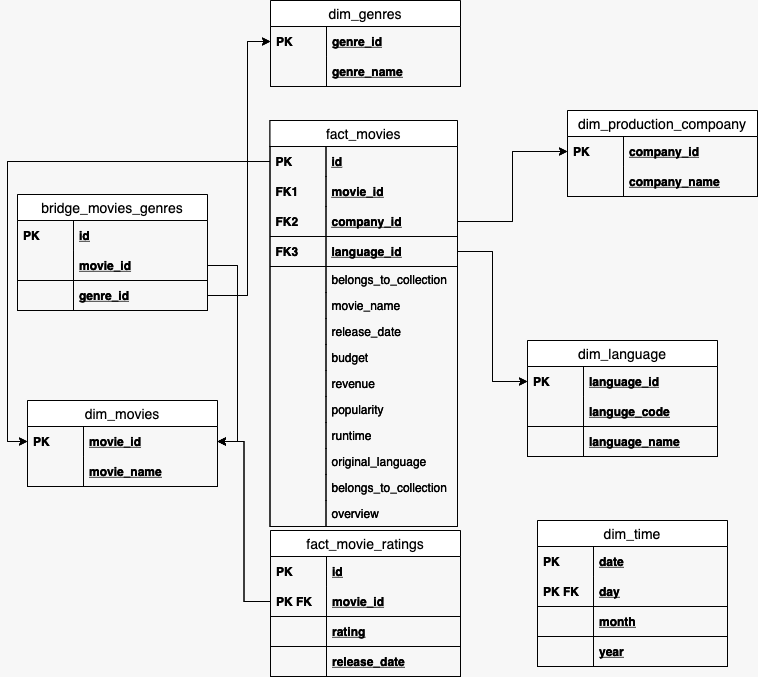
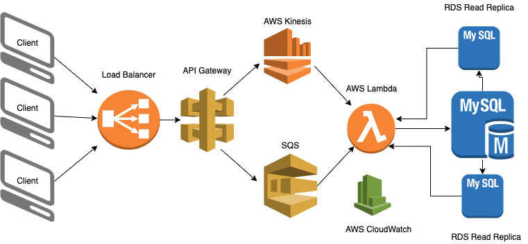

# Overview
The goal of this project is to get an idea of:
* Your ability to work with and grok data 
* Your software engineering skill 
* Your system design skill 

The data used for this project will be The Movies Dataset (pulled from https://www.kaggle.com/rounakbanik/the-movies-dataset).
Please use the copy of the data set provided at https://s3-us-west-2.amazonaws.com/com.guild.us-west-2.public-data/project-data/the-movies-dataset.zip
# Requirements

There are three goals to this project:
* Design a data model that can be used to answer a series of questions. 
* Implement a program that transforms the input data into a form usable by the data model
* Design a system that can leverage the data model and program to provide real time access to the data (This is a design task, do not implement)

The designed data model must expose the following information: 

* Production Company Details:
    * budget per year
    * revenue per year
    * profit per year
    * releases by genre per year
    * average popularity of produced movies per year
    
* Movie Genre Details:
    * most popular genre by year
    * budget by genre by year
    * revenue by genre by year
    * profit by genre by year

# Deliverables

Fork this repository and complete all relevant tasks in that forked repository

## Data Model 
Please provide a visual diagram of the chosen data model. 

## Implementation
The input for the program will be the raw data (CSV files) in The Movies Dataset.
The output for the program will be one or more files that can be used to hydrate the data model. 

Feel free to use any language you are comfortable with. (A JVM language or Python is preferable if possible)

## Design
The goal of the design task is to design a system that exposes this data to end users via an HTTP API.
When designing the system focus on the high level design of the system and how parts of it will interact. 
You don't need to go very deep on the API, don't worry about defining routes/types/etc. 

Assumptions: 
* New data files are received monthly
* The system should be scalable

The design should include: 
* Data transformation - using the program implemented above
* Data storage - How will the data be stored?
* Data serving - How will users access the data?

Be sure to discuss issues and trade-offs around scaling, monitoring, failure recovery, authentication, etc... 

 
## Jing Scribner
 
## Notes:
* I used snowflake schema as the data model for this project due to the fact table has a different level of granularity. Ex: a movie could belong to different genres
   * Benefit - slice the data at different granularity for analytics purpose
   * Trade-off - an additional level of attribute normalization adds complexity when doing joins
* Due to the timing, below are the areas that could be improved on:
   * The data model is not designed thoroughly
   * The program business logic is not complete. Ex. Could include a folder with more detailed business logic on how to map to dimensional tables to get the foreign keys to update the fact table.
   * Encapsulate the code better. Ex. Could create a class for the main.py file or even create a common library to encapsulate some functions to make the code more sustain.
   * Logics for unit tests
 
## Data Model
 

 
## Implement a program that transforms the input data into a form usable by the data model:
   * `python3 main.py` - The entry point to run the program
   * `process.py` - The logics of MySQL connector to update the data model
   * `tests/test_main.py` - The place holder to do unit testing
   * `db_schema.json` - The table schemas map for processing insertions
   * `design` - The folder to hold the data model and system design architecture print
 
 
 
 
## Design
 

 
* This architecture design is based on focusing on Consistency and Availability (CAP consideration). Since the assumption is that the data gets updated monthly, a relational database should be good enough for analytics usage. I choose to build this through serverless computing considering the needs of scalability and reliability.
 
* Quick POC version
  *  New data files are received -> API Gateway -> kick off the lambda function to authenticate the source of the data,
   run data transformations -> Store the data into MySQL database
 
The above design is a poc version, for production, we could consider using the other AWS services to help to decouple the pipeline
 
* Production version
  *  New data files are received -> API Gateway -> AWS Kinesis/SQS (buffer incoming requests)
   -> kick off the lambda function to authenticate the source of the data,
   run data transformations -> Store the data into MySQL database
 
* Authentication: EventBridge, AWS secret manager, KMS
* Monitoring: CloudWatch Logs, PagerDuty, DataDog
* Failure recovery: Availability - load balancer, database replica, aws auto scaling etc...
 
* Tradeoffs of above design:
   * Serverless computing tends to cost less, however, increasing traffics can increase the bill unexpectedly.
   It could be tricky and difficult to debugging lambda. Keep in mind to have very detailed and clear logging information to help to debug. Especially if the whole process was set up manually through the UI instead of using terraform or
   CloudFormation, it could be difficult to track what's going on.

